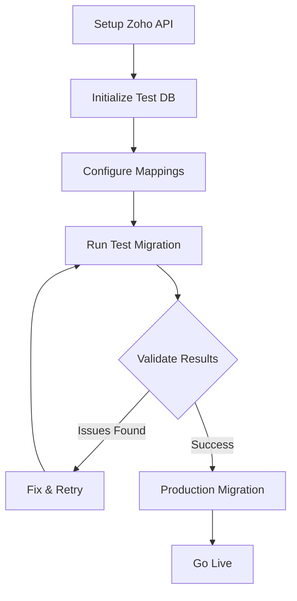

# 🔄 Zoho to Odoo Enterprise Migration Tool

Complete migration solution for transferring data from **Zoho Books** and **Zoho Inventory** to **Odoo Enterprise 18**.

## 📋 OVERVIEW

This migration tool provides:
- ✅ **Automated data extraction** from Zoho APIs
- ✅ **Field mapping and transformation** 
- ✅ **Test environment** for safe migration testing
- ✅ **Error handling and logging**
- ✅ **Production-ready deployment**

## 🏗️ ARCHITECTURE

```
/opt/odoo/migration/
├── 📄 zoho_odoo_migrator.py      # Main migration script
├── 📄 setup_zoho_auth.py         # Zoho API authentication setup
├── 📄 init_test_db.py            # Test database initialization
├── 📄 README.md                  # This file
├── 📁 config/
│   ├── zoho_config.json          # API credentials and settings
│   └── field_mapping.json        # Field mappings between systems
├── 📁 data/
│   ├── raw/                      # Raw data from Zoho APIs
│   ├── processed/                # Transformed data ready for Odoo
│   └── failed/                   # Failed records for review
└── 📁 logs/
    └── migration.log             # Detailed migration logs
```

## 🚀 QUICK START

### Step 1: Initialize Test Environment
```bash
cd /opt/odoo/migration
python init_test_db.py
```

### Step 2: Set Up Zoho API Authentication
```bash
python setup_zoho_auth.py
```

### Step 3: Run Test Migration
```bash
python zoho_odoo_migrator.py test
```

### Step 4: Validate and Go Live
```bash
# After successful testing:
python zoho_odoo_migrator.py production
```

## 📊 DETAILED MIGRATION PROCESS

### Phase 1: Preparation (Day 1)

#### 1.1 Zoho API Setup
1. **Create Zoho Developer Account**
   - Visit: https://api-console.zoho.com/
   - Sign in with your Zoho account
   - Create a new Server Application

2. **Get API Credentials**
   - Note your Client ID and Client Secret
   - Find your Organization ID from Zoho Books URL
   - Set redirect URI: `http://localhost:8080/callback`

3. **Configure Authentication**
   ```bash
   python setup_zoho_auth.py
   # Follow the interactive setup process
   ```

#### 1.2 Test Database Setup
```bash
# Initialize test database with required modules
python init_test_db.py

# Verify test database (optional)
cd /opt/odoo && source odoo-venv/bin/activate
python odoo-community/odoo-bin -c odoo_test.conf
# Access at http://localhost:8070
```

### Phase 2: Data Mapping (Day 2)

#### 2.1 Review Field Mappings
Edit `/opt/odoo/migration/config/field_mapping.json` to customize how Zoho fields map to Odoo fields.

#### 2.2 Configure Migration Settings
Edit `/opt/odoo/migration/config/zoho_config.json`:
- Adjust batch sizes
- Set rate limits
- Configure retry settings

### Phase 3: Test Migration (Days 3-4)

#### 3.1 Run Test Migration
```bash
# Start with a single data type
python zoho_odoo_migrator.py test

# Monitor progress
tail -f logs/migration.log
```

#### 3.2 Validate Test Results
1. **Check Record Counts**
   ```bash
   # Compare Zoho vs Odoo counts
   # Access test database at http://localhost:8070
   ```

2. **Review Failed Records**
   ```bash
   ls -la data/failed/
   # Review any failed imports
   ```

3. **Test Business Processes**
   - Create test invoices
   - Process payments
   - Generate reports

### Phase 4: Production Migration (Day 5)

#### 4.1 Pre-Migration Checklist
- [ ] Test migration completed successfully
- [ ] Business processes validated
- [ ] Team trained on Odoo
- [ ] Backup plan ready

#### 4.2 Production Migration
```bash
# This will create automatic backup before migration
python zoho_odoo_migrator.py production
```

## 📋 DATA TYPES MIGRATED

### Zoho Books → Odoo
| Data Type | Zoho Books | Odoo Model | Status |
|-----------|------------|------------|--------|
| Customers | Contacts | res.partner | ✅ Ready |
| Vendors | Vendors | res.partner | ✅ Ready |
| Products | Items | product.template | ✅ Ready |
| Invoices | Invoices | account.move | ✅ Ready |
| Bills | Bills | account.move | ✅ Ready |
| Accounts | Chart of Accounts | account.account | ✅ Ready |
| Taxes | Tax Rates | account.tax | ✅ Ready |

### Zoho Inventory → Odoo
| Data Type | Zoho Inventory | Odoo Model | Status |
|-----------|----------------|------------|--------|
| Stock Levels | Inventory | stock.quant | ✅ Ready |
| Warehouses | Warehouses | stock.warehouse | ✅ Ready |
| Adjustments | Adjustments | stock.inventory | ✅ Ready |

## 🔧 CONFIGURATION

### Migration Settings
```json
{
  "migration_settings": {
    "batch_size": 100,           // Records per batch
    "delay_between_requests": 0.6, // Seconds between API calls
    "max_retries": 3,            // Retry failed requests
    "backup_before_import": true, // Auto backup production
    "validate_data": true,       // Validate before import
    "log_level": "INFO"          // Logging detail level
  }
}
```

### Field Mapping Example
```json
{
  "customers": {
    "zoho_books": {
      "contact_name": "name",
      "email": "email",
      "phone": "phone"
    },
    "odoo_model": "res.partner",
    "required_fields": ["name", "email"],
    "default_values": {
      "customer_rank": 1
    }
  }
}
```

## 📊 MONITORING & TROUBLESHOOTING

### Log Files
```bash
# Migration logs
tail -f /opt/odoo/migration/logs/migration.log

# Odoo test server logs
tail -f /var/log/odoo/odoo_test.log

# Odoo production logs  
tail -f /var/log/odoo/odoo.log
```

### Common Issues

#### Authentication Errors
```bash
# Re-run authentication setup
python setup_zoho_auth.py

# Check API rate limits in logs
grep "rate limit" logs/migration.log
```

#### Data Import Errors
```bash
# Review failed records
ls -la data/failed/
cat data/failed/customers_failed_*.json

# Check field validation errors
grep "validation" logs/migration.log
```

#### Performance Issues
```bash
# Adjust batch size in config
# Increase delay between requests
# Monitor system resources: htop
```

## 🔄 MIGRATION WORKFLOW



## 📈 SUCCESS METRICS

### Data Quality KPIs
- **Accuracy**: >99% records migrated correctly
- **Completeness**: All critical data transferred
- **Integrity**: Financial totals match exactly

### Performance KPIs  
- **Migration Speed**: <8 hours total
- **Downtime**: <4 hours for cutover
- **Error Rate**: <1% failed records

## 🚨 EMERGENCY PROCEDURES

### Rollback Plan
```bash
# Stop Odoo
systemctl stop odoo

# Restore from backup
sudo -u postgres dropdb odtshbrain
sudo -u postgres createdb odtshbrain
sudo -u postgres psql odtshbrain < /opt/odoo/backups/migration_backup_*.sql

# Restart Odoo
systemctl start odoo
```

### Contact Support
- **Migration Logs**: `/opt/odoo/migration/logs/`
- **System Status**: `systemctl status odoo`
- **Database Status**: `sudo -u postgres psql -l`

## 🎯 BEST PRACTICES

### Before Migration
1. **Clean Zoho Data**: Remove duplicates and test entries
2. **Document Processes**: Map current workflows
3. **Train Team**: Ensure users understand Odoo basics

### During Migration
1. **Monitor Progress**: Watch logs actively
2. **Validate Continuously**: Check samples during migration
3. **Communicate**: Keep stakeholders informed

### After Migration
1. **Reconcile Totals**: Verify all financial data
2. **Test Workflows**: Ensure business processes work
3. **Document Changes**: Update procedures and training

## 📞 SUPPORT COMMANDS

```bash
# Check migration status
python /opt/odoo/migration/zoho_odoo_migrator.py --status

# Validate Zoho connection
python /opt/odoo/migration/setup_zoho_auth.py

# Test Odoo connection
curl -I http://localhost:8069  # Production
curl -I http://localhost:8070  # Test

# View system health
/opt/odoo/check_odoo.sh
```

---

## 📜 LICENSE & DISCLAIMER

This migration tool is provided as-is for facilitating data migration from Zoho to Odoo Enterprise. Always test thoroughly before production use and maintain proper backups.

**Happy Migrating!** 🚀 