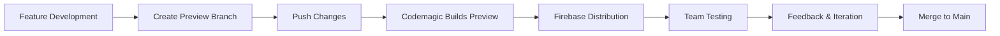

# 🔍 Codemagic App Preview Setup Guide

This guide will help you set up Codemagic for previewing your TSH Salesperson App quickly and efficiently.

## 🎯 What is App Preview?

App Preview allows you to:
- ✅ **Quick builds** for testing changes
- ✅ **Debug APKs** ready to install
- ✅ **iOS simulator builds** for immediate testing
- ✅ **Firebase App Distribution** for easy sharing
- ✅ **Fast feedback loop** for development

## 🚀 Setup Steps

### 1. **Workflow Configuration** ✅

I've added a new `preview` workflow to your `codemagic.yaml` that:
- Triggers on `preview/*`, `feature/*`, and `develop` branches
- Builds debug versions for quick testing
- Uses Firebase App Distribution for sharing
- Sends notifications to your team

### 2. **Environment Variables Setup**

You need to configure these in Codemagic:

#### **Required Variables:**
```bash
# Firebase App Distribution (Optional but recommended)
FIREBASE_TOKEN=your_firebase_token
FIREBASE_ANDROID_APP_ID=your_android_app_id
FIREBASE_IOS_APP_ID=your_ios_app_id
```

#### **Existing Variables (Already configured):**
```bash
# These should already be set up
FLUTTER_VERSION=3.24.5
XCODE_WORKSPACE=ios/Runner.xcworkspace
XCODE_SCHEME=Runner
```

### 3. **Firebase App Distribution Setup (Optional)**

For the best preview experience, set up Firebase App Distribution:

1. **Go to Firebase Console**: https://console.firebase.google.com/
2. **Select your project** or create a new one
3. **Add your Android app**:
   - Package name: `com.tsh.sales.tsh_salesperson_app`
   - Download `google-services.json`
4. **Add your iOS app**:
   - Bundle ID: `com.tsh.sales.tsh_salesperson_app`
   - Download `GoogleService-Info.plist`
5. **Enable App Distribution**
6. **Create tester groups**: `tsh-testers`, `developers`

### 4. **Codemagic Configuration**

#### **In Codemagic Dashboard:**

1. **Go to your app** → **Settings** → **Environment variables**
2. **Add Firebase variables** (if using Firebase):
   ```
   FIREBASE_TOKEN: [Your Firebase CLI token]
   FIREBASE_ANDROID_APP_ID: [Your Android app ID from Firebase]
   FIREBASE_IOS_APP_ID: [Your iOS app ID from Firebase]
   ```

3. **Create variable groups**:
   - `tsh_dev_vars`: Development-specific variables
   - Add any preview-specific configurations

#### **Keystore Setup** (Already done):
- ✅ `tsh_keystore` is configured
- ✅ Passwords and aliases are set

## 🔧 How to Use App Preview

### **Method 1: Branch-based Triggering**

1. **Create a preview branch**:
   ```bash
   git checkout -b preview/new-feature
   git push origin preview/new-feature
   ```

2. **Push changes**:
   ```bash
   git add .
   git commit -m "Add new feature for preview"
   git push
   ```

3. **Codemagic automatically builds** and sends you:
   - 📧 Email with download links
   - 📱 Firebase App Distribution notification
   - 💬 Slack notification (if configured)

### **Method 2: Manual Trigger**

1. **Go to Codemagic Dashboard**
2. **Select your app**
3. **Choose "preview" workflow**
4. **Click "Start new build"**
5. **Select branch and start**

### **Method 3: Pull Request Preview**

1. **Create a pull request** to `develop` or `main`
2. **Codemagic automatically builds** a preview
3. **Review the app** before merging

## 📱 Testing Your Preview

### **Android Testing:**
1. **Download the APK** from email or Firebase
2. **Enable "Unknown sources"** on your Android device
3. **Install and test** the app
4. **Provide feedback** via your preferred channel

### **iOS Testing:**
1. **Download from Firebase App Distribution**
2. **Install on registered device** or use simulator
3. **Test the latest changes**
4. **Report any issues**

## 🔔 Notification Setup

### **Email Notifications** ✅
- Configured to send to: `kha89ahm@gmail.com`
- Includes build status and download links

### **Slack Notifications** (Optional)
To enable Slack notifications:
1. **Create a Slack webhook** for `#tsh-previews` channel
2. **Add webhook URL** to Codemagic environment variables
3. **Team gets notified** of new preview builds

### **Firebase Notifications** (If configured)
- **Automatic app updates** via Firebase App Distribution
- **Tester groups** get notified of new builds
- **Easy installation** via Firebase app

## 📊 Preview Workflow Features

### **Fast Build Times:**
- ⚡ **45-minute timeout** (usually completes in 10-15 minutes)
- 🔧 **Debug builds only** (faster than release builds)
- 📱 **Parallel Android/iOS builds**

### **Quality Checks:**
- 🔍 **Quick analysis** (non-blocking)
- 🧪 **Basic tests** (continues on failure)
- 📋 **Build information** generation

### **Artifacts Generated:**
- 📦 **Android Debug APK** (ready to install)
- 🍎 **iOS Debug App** (simulator + device)
- 📄 **Preview information** file
- 📊 **Build logs** for debugging

## 🛠️ Troubleshooting

### **Common Issues:**

1. **Build Fails on Analysis:**
   - Preview workflow continues even if analysis fails
   - Check logs for specific issues
   - Fix critical errors for production builds

2. **Firebase Distribution Not Working:**
   - Verify Firebase token is valid
   - Check app IDs are correct
   - Ensure tester groups exist

3. **iOS Build Issues:**
   - Verify Xcode version compatibility
   - Check iOS signing configuration
   - Ensure CocoaPods dependencies are resolved

### **Debug Steps:**

1. **Check build logs** in Codemagic dashboard
2. **Verify environment variables** are set correctly
3. **Test locally** with same Flutter version
4. **Check Firebase console** for distribution issues

## 🚀 Advanced Preview Features

### **Custom Preview Branches:**
Create branches with specific naming for automatic previews:
```bash
git checkout -b preview/ui-improvements
git checkout -b preview/bug-fixes
git checkout -b preview/new-api-integration
```

### **Feature Branch Previews:**
Any `feature/*` branch automatically triggers preview builds:
```bash
git checkout -b feature/customer-management
git checkout -b feature/offline-sync
```

### **Development Branch Previews:**
The `develop` branch automatically builds previews for continuous testing.

## 📈 Best Practices

1. **Use descriptive branch names** for easy identification
2. **Test previews thoroughly** before merging to main
3. **Keep preview builds small** and focused
4. **Provide feedback quickly** to maintain development velocity
5. **Clean up old preview branches** regularly

## 🔄 Integration with Development Workflow



## 📞 Support

For issues with app preview setup:
1. **Check Codemagic logs** for build errors
2. **Verify environment variables** are configured
3. **Test Firebase integration** separately
4. **Contact team** for access issues

---

**Happy Previewing! 🎉**

Your TSH Salesperson App preview system is now ready for fast, efficient testing and feedback cycles!